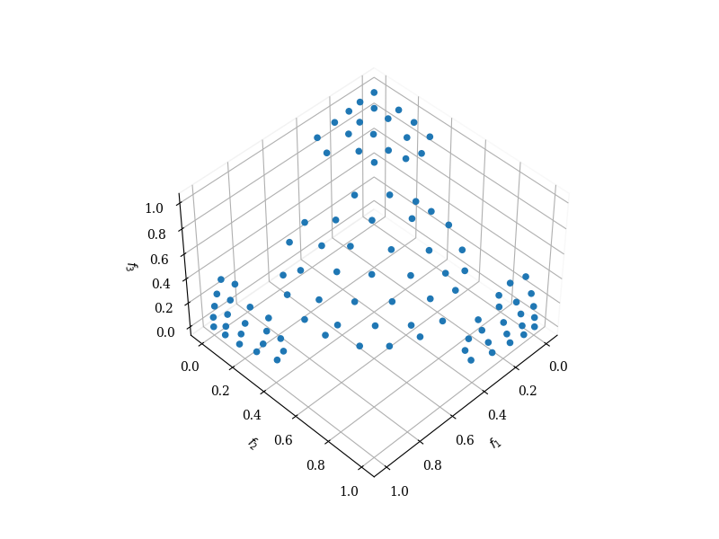

# MuSt-EMaO

Evolutionary multi-objective and many-objective optimization (EMO and EMaO) algorithms are increasingly being used to identify the true shape and location of the Pareto-optimal front using a few representative well-converged and well-distributed solutions. The reason for their popularity is due to their ability to provide a better understanding of objective relationships for optimal solutions, and also to facilitate the choice of a preferred solution using an interactive or post-optimal multi-criterion decision analysis. However, since EMO and EMaO algorithms are stochastic, a single application may not provide a true representative set with a desired number of Pareto solutions reliably in repetitive runs and importantly with a well-distributed set of solutions. In this paper, we propose a multi-stage framework involving reference-vector based evolutionary multi- and many-objective algorithms (MuSt-EMO and MuSt-EMaO) that attempts to recursively rectify shortcomings of previous stages by careful executions of subsequent stages so that a prescribed number of well-distributed and well-converged solutions are achieved at the end. The proposed multi-stage approach is implemented to a number of popular reference vector based EMO/EMaO algorithms and is applied on various multi-and many-objective test and real-world problems.  

This code is the implementation of our proposed framework, as described in 
[Identifying Pareto Fronts Reliably Using a Multi-Stage Reference-vector-based Framework](https://ieeexplore.ieee.org/document/10057109)

This code was implemented using pymoo  

## Installation:

As we use [pymoo](https://pymoo.org/), it is necessary to install it.
 

```
pip install -U pymoo
```

## Usage:

```python
import numpy as np
from pymoo.factory import get_problem,get_reference_directions
from pymoo.visualization.scatter import Scatter
from MuSt_EMaO import MuSt_EMaO

if __name__ == '__main__':
    seed_p = 7
    n_points = 100
    nb_eval = 20000
    n_obj = 3

    problem = get_problem("C2DTLZ2", n_obj=n_obj)
    
    gamma=1/2

    data_unit_simplex = get_reference_directions("energy", n_obj, int(n_points), seed=seed_p)
    
    ##########################################################################################################
    # MuSt_EMaO:
    # Input: a problem test set, number of solutions, number of objectives, a seed, a total number of solution
    #       evaluations, a gamma to apply in the T configuration set(tested values are 2/3, 1/3 and 1/2),
    #       a log print-- verbose,
    #       an EMaO algorithm (3 algorithms are available in this implementation: NSGA-III, MOEA/D, C-TAEA) ,
    # Output: ND solutions in objective space with number of solutions, number of generations, number of
    #        solutions evaluations executed, the final reference vector in Stage 3 with i=2
    ##########################################################################################################
    final_PF, total_ngen, total_neval, MSEA_resolution = MuSt_EMaO(problem, n_points, n_obj, seed_p, nb_eval, gamma,
                                                                   True, alg='NSGA-III')
    
    #Visualization
    plot = Scatter()
    plot.add(final_PF)
    plot.show(block=True)
    plot.interactive(False)

```
## Output:

With this piece of code, the output will be a scatter plot:



## Contributing
Pull requests are welcome. For major changes, please open an issue first to discuss what you would like to change.

Please make sure to update tests as appropriate.

## Citing This Work
You can cite this code as follows:

K. Deb, C. L. d. V. Lopes, F. V. C. Martins and E. F. Wanner, "Identifying Pareto Fronts Reliably Using a Multi-Stage Reference-vector-based Framework," in IEEE Transactions on Evolutionary Computation, doi: 10.1109/TEVC.2023.3246922.


### Bibtex

@ARTICLE{10057109,
  author={Deb, Kalyanmoy and Lopes, Claudio Lucio do Val and Martins, Flávio Vinícius Cruzeiro and Wanner, Elizabeth Fialho},
  journal={IEEE Transactions on Evolutionary Computation}, 
  title={Identifying Pareto Fronts Reliably Using a Multi-Stage Reference-vector-based Framework}, 
  year={2023},
  volume={},
  number={},
  pages={1-1},
  doi={10.1109/TEVC.2023.3246922}}

## License
[MIT](https://choosealicense.com/licenses/mit/)